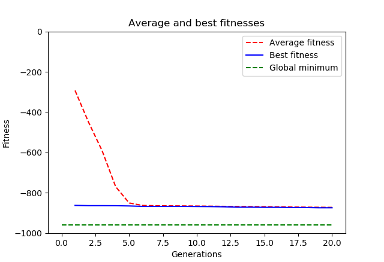

Trying to optimize the eggholder function, which is a 2D function. The individuals of the population
are 2-D vectors of floating point numbers (x and y coordinates).

Let's try to use different initialization types.

The following other operations and hyperparameters were used and are fixed throughout the experiment:
```python
toolbox.register('mate', tools.cxOnePoint)
toolbox.register('mutate', tools.mutGaussian, mu=0, sigma=0.2, indpb=0.2)
toolbox.register('select', tools.selTournament, tournsize=3)
CXPB, MUTPB = 0.05, 0.4
generations = 20
offspring = toolbox.select(pop, len(pop))
```

## 1. Testing initial population size
The individials are initialized randomly uniform in the domain (x,y) € [-512, 512] x [-512, 512]
```python
toolbox.register('attr_float', random.uniform, -512, 512)
toolbox.register('individual', tools.initRepeat, creator.Individual, toolbox.attr_float, 2)
```

#### Results for pop size = 5
Best individual is [-246.59728595 -271.92289257], Fitness=(-288.42650946502306,)
Depends a lot on luck: if the few individuals are initially close to a minimum, you might get a better result
than if the individuals are initially located in bad positions.
Does not seen to optimize at all: the individual with the best initial fitness does not change at all - seems like
it gets stuck in a local minimum, and all the other individuals 'join' him there.
Total execution time 0.005453 s


#### Results for pop size = 100
We get consistently better results than when having very few individuals. Still dependent on initial locations
of individuals, but there are better chances of having individuals that start in good postitions. Same problem as
above: the best individual seems 'stuck' in a local minimum. 
Total execution time 0.042105 s



#### Results for pop size = 500
The quality of the results is visible and you get them much more often than when using lower population sizes.
There is also a better tendency to observe an optimization of the best individual, i.e. overcoming the problem
of getting stuck (can be seen through the knick in the blue line of the graph).
Total execution time 0.178011 s
The experiment shows that the total execution time increases the larger the initial population is. Furthermore,
memory consumption is also increased, since you need to store more data in memory.
Best individual is [477.992065   428.52471174], fitness = (-953.3436730033045,)
seed = 1


## 2. Testing random  Normal initialization instead of Uniform
In this experiment, we fix population size to 100 (except where explicitly stated otherwise) and initialize the 
individuals using the Normal distribution:
```python
toolbox.register('attr_float', random.gauss, mu, sigma)
```
My pre-experimental hypothesis: The larger sigma, the more spread out the initial population is and the more chances
there are to create individuals with a good initial fit. Setting the mu should bias the solution, since there will be
more individuals spread around the mu-value. This feature could come in handy in case you have some knowledge of the
fitness landscape, i.e. you suspect in what region the solution might be.

#### Result for mu=0, sigma=1
Results are terrible; Best individual is [0.62421582 4.5236292 ], fitness = (-41.35282169610378,)
Since there is very little spread of the data, you need to be super lucky to find a minimum.


#### Result for mu=0, sigma=50
Even increasing the spread of the initial data does not do well, since we are biasing our result
to mu = 0. Result is worse than uniform distribution for pop size=100.


#### Result for mu=450, sigma=1
Let's test how it will fare if we incorporate some domain knowledge. From the previous experiment, we 
know that a good solution is [477.992065   428.52471174]. So let's initialize mu = 450, sigma=1.
It seems that my suspicion was right; we get a very good result ([445.12996761 453.05323373], fitness = (-894.3197990422195,))
compared to the first Gaussian initialization case and compared to the case with the uniform initialization using
a population of 100. Quality of results is also very robust.
Idea: why not modify the genetic algorithm such that, in each generation, it spawns new individuals that are close
to the individual with the best fitness value?


#### Result for mu=450, sigma=1, pop = 10
Best individual is [448.75689243 451.38285541], fitness = (-799.8780715229962,)
Even for a lower population size, the algorithm does fairly well, although not so good as when population is
100. This is consistent to our findings in the first experiment.


## Conclusions:
* The larger the initial population size, the more chances there are to start with 'good individuals' and get
a better optimization solution. Robustness increases (you are less dependent on luck to start with good individuals)
and there is more chances that you do not get stuck in local minima, as shown empirically. The downside is that
you will need a longer execution time and higher memory consumption.
* Uniform initialization is a better choice when you have no knowledge of the fitness landscape.
* Gaussian initialization is a better choice when you do habe some knowledge of the fitness landscape
and you intend to bias your solution to a specific domain. A similar approach would be to use the uniform
distribution with more specific initialization regions.


