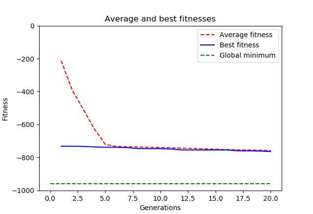
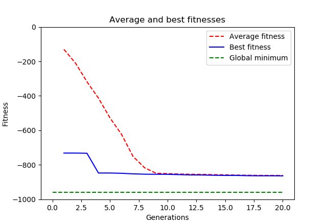
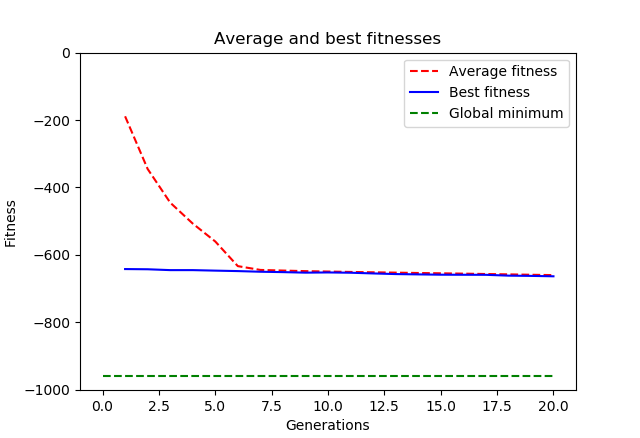
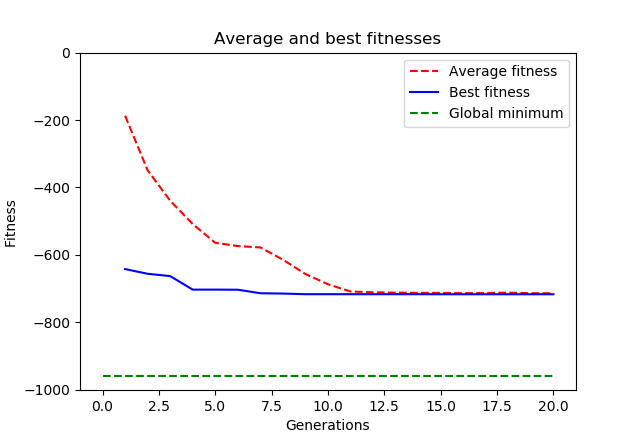
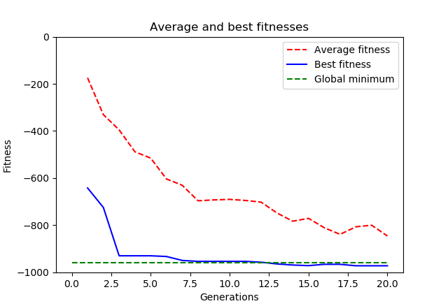
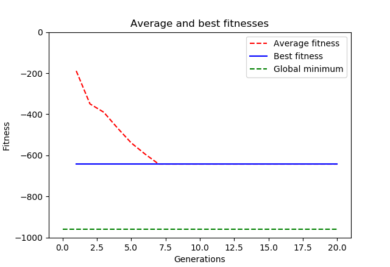
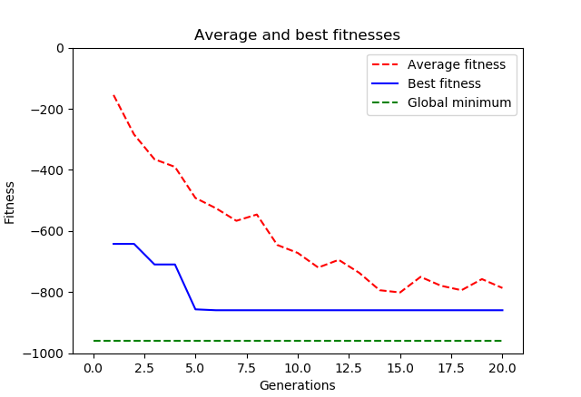
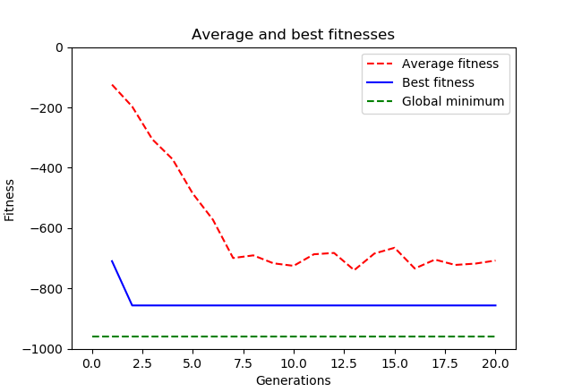

In this experiment, I will test the crossover and mutation operations.

# Crossover
The following other operations and hyperparameters were used and are fixed throughout the experiment:
```python
toolbox.register('attr_float', random.uniform, -512, 512)
toolbox.register('individual', tools.initRepeat, creator.Individual, toolbox.attr_float, 2)
pop size = 100
toolbox.register('mutate', tools.mutGaussian, mu=0, sigma=0.2, indpb=0.2)
toolbox.register('select', tools.selTournament, tournsize=3)
MUTPB = 0.4
generations = 20
offspring = toolbox.select(pop, len(pop))
```

##1. Not applying vs. applying crossover
toolbox.register('mate', tools.cxTwoPoint)

No crossover:



With crossover CXPB = 0.7:



It seems that crossover is a good remedy against the problem of getting stuck in local minima.
That problem often occurs when no crossover is used at all. If the best individuals produce offspring 
that are slightly different from themselves, that offspring may be in a better position and avoid a 
local minimum. My experiments showed that a CXPB of around 0.5-0-7 is a good choice. Increasing CXPB 
too much, or setting it to 1 will most not produce good results (except if you have a very large initial 
population).

#Mutation
The following other operations and hyperparameters were used and are fixed throughout the experiment:
```python
toolbox.register('attr_float', random.uniform, -512, 512)
toolbox.register('individual', tools.initRepeat, creator.Individual, toolbox.attr_float, 2)
pop size = 100
toolbox.register('mate', tools.cxOnePoint)
toolbox.register('select', tools.selTournament, tournsize=3)
CXPB = 0.3
generations = 20
offspring = toolbox.select(pop, len(pop))
```
##1. Testing Gaussian Mutation
```python
MUTPB = 0.5
toolbox.register('mutate', tools.mutGaussian, mu=0, sigma=X, indpb=0.5)
```
Let's try to vary sigma:

SIGMA = 0.2



SIGMA = 5



SIGMA = 20



Seems that increasing the variance of the mutation is a good remedy agains local minima. Similar
to crossover, the more novelty we introduce to the algorithm the less likely it is to get stuck.

##2. Testing shuffling mutation
toolbox.register('mutate', tools.mutShuffleIndexes, indpb=0.5)

MUTPB = 0.0



MUTPB = 0.2



MUTPB = 0.6



This one is very interesting: It seems that shuffling the indices is an even better remedy for local minima
than Gaussian mutation. This can be seen by the sharper knick in the blue curve when increasing the mutation
probability. 

Another observation: the more we increase the mutation rate, the more the average fitness of the population 
diverges from the best individual's fitness.


