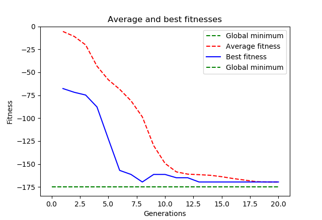
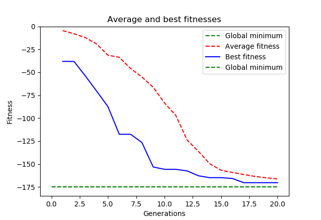
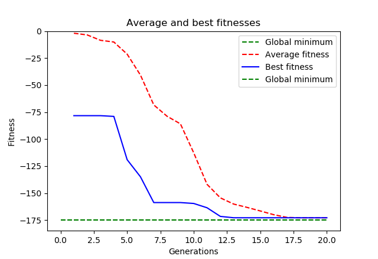

This experiment aims a deeper testing of crossover. For the testing, I used the following multivariate test function, 
called Alpine 2 Function, with n = 5 dimensions:

- 

The global minimum is located at x∗= (7.917, ... , 7.917), f(x*) = 2.808^n.
Throughout the experiment, the following options are kept fixed:
```python
DIMENSIONS = 5
population size = 200
generations = 20
toolbox.register('attr_float', random.uniform, 0, 10)
toolbox.register('select', tools.selTournament, tournsize=3)
MUTPB = 0
```

## 1. Trying different kinds of crossover
For each of the following, the experiment was repeated 100 times, each time with a different initialization.
In each subsection, we show the experiment that got the best result. Crossover probability is fixed to 0.6.

### A) Single Point Crossover 
Experiments with a score better than -120: 30/100

Experiments with a score better than -150: 15/100

Experiments with a score better than -170: 0/100

Best experimental result:

Best individual:  [8.11240237 7.93968618 7.84714226 7.8010144  7.94624159]
Best fitness: -169.5334137823707



### B) Two Point Crossover 
Experiments with a score better than -120: 59/100

Experiments with a score better than -150: 29/100

Experiments with a score better than -170: 1/100

Best experimental result:

Best individual:  [8.04540554 7.80556469 8.04510261 7.86414926 7.95450242]
Best fitness: -170.27786525997797



### C) Uniform Crossover with indpb=0.3 
Experiments with a score better than -120: 80/100

Experiments with a score better than -150: 60/100

Experiments with a score better than -170: 5/100

Best experimental result:

Best individual:  [7.96937432 7.96477533 7.97544575 7.97059479 7.81864992]
Best fitness: -172.7732086493284




## 2. Trying different crossover probabilities
Two-point crossover is used all the time.
### A) CXPB = 0.1
Experiments with a score better than -120: 28/100

Experiments with a score better than -150: 12/100

Experiments with a score better than -170: 0/100

Best experimental result:

Best individual:  [8.09451845 7.89348504 7.87686263 8.05860273 7.85585365]
Best fitness: -169.56525747241142

### B) CXPB = 0.3
Experiments with a score better than -120: 53/100

Experiments with a score better than -150: 28/100

Experiments with a score better than -170: 2/100

Best experimental result:

Best individual:  [7.88536829 7.85460983 7.80418729 8.03928177 7.95442421]
Best fitness: -171.63425851600138

### C) CXPB = 0.5
Experiments with a score better than -120: 75/100

Experiments with a score better than -150: 54/100

Experiments with a score better than -170: 9/100

Best experimental result:

Best individual:  [7.89516325 7.99592407 8.0141505  7.9958452  7.87657612]
Best fitness: -172.50272921308473

### D) CXPB = 0.7
Experiments with a score better than -120: 84/100

Experiments with a score better than -150: 64/100

Experiments with a score better than -170: 8/100

Best experimental result:

Best individual:  [7.91904247 7.88047332 7.8059047  7.85461895 7.95799066]
Best fitness: -172.92613751496899


### E) CXPB = 0.9
Experiments with a score better than -120: 94/100

Experiments with a score better than -150: 71/100

Experiments with a score better than -170: 13/100

Best experimental result

### F) CXPB = 1

Experiments with a score better than -120: 89/100

Experiments with a score better than -150: 75/100

Experiments with a score better than -170: 15/100

Best experimental result:

Best individual:  [7.95417318 7.88972461 7.87615728 7.94754165 7.81849585]
Best fitness: -173.3480046377309

## Conclusions
The experiments show that some kind of crossover are more successful in
our task than others, in terms of finding good solutions more frequently.
From best to worst, they are ranked Uniform Crossover, Two-Point crossover and One-Point Crossover.

Varying the crossover probability also had a high infuence in the results: increasing it
makes the algorithm produce good results more frequently. Even CXPB = 1 turned to be perfectly fine;
it actually proved to be the most effective.