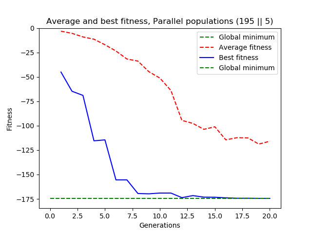

# Parallel populations experiment

###### Two populations POP_A depends on POP_A and POP_B, POP_B depends only on POP_B

This experiment aims to test parallel selection idea - two parallel populations.
```python
POP_A = selTournament(POP_A , POP_B) 
POP_B = selSomeMoreRandomMethod(POP_B)
```
Selection was tested on the 5-dimensional Alpine-2 test function.


The global minimum is located at x∗= (7.917, ... , 7.917), f(x*) = 2.808^n.
Throughout the experiment, the following options are kept fixed:
```python
# Hyperparameters
CROSSOVER_PROBABILITY = 1.0
MUTATION_SIGMA = 0.4
MUTATION_PROBABILITY = 0.9
TOURNAMENT_SIZE = 4
OBJECTIVE_DIMENSIONS = 5

toolbox.register('evaluate', alpine2)
toolbox.register('mate', tools.cxTwoPoint)
toolbox.register('mutate', tools.mutGaussian, mu=MUTATION_SIGMA, sigma=MUTATION_PROBABILITY, indpb=0.2)
toolbox.register('select_tournament', tools.selTournament, tournsize=TOURNAMENT_SIZE)
toolbox.register('select_random', tools.selRandom)
```

The following variables were changed in the experiment:
```python
POPULATION_SIZE_TOURNAMENT = """e.g.""" 200
POPULATION_SIZE_RANDOM = """e.g.""" 10
```

### Overview

This experiment builds on conclusions of the experiment_selection - to find a good solution
and converge towards the global optimum selection process needs to combine randomness/diversity 
and logic for the particular problem. Randomness ensures the population doesn't get stuck. Logical
selection rules help to ensure convergence to an improving solution.

This experiment uses the idea of two parallel populations - one that provides convergence to solution
and the other that provides additional and independent randomness/diversity.

### Results

#### 1. Parallel population relative size testing

##### 1.1. POPULATION_SIZE_TOURNAMENT = 200, POPULATION_SIZE_RANDOM = 0

* Experiments with a score better than -120: 88/100
* Experiments with a score better than -150: 88/100
* Experiments with a score better than -170: 85/100


Best experimental result

Best individual:  [7.93117176 7.90700795 7.94220435 7.91079303 7.92009054]

Best fitness: -174.53042878592086


##### 1.2. POPULATION_SIZE_TOURNAMENT = 199, POPULATION_SIZE_RANDOM = 1

* Experiments with a score better than -120: 89/100
* Experiments with a score better than -150: 89/100
* Experiments with a score better than -170: 87/100


Best experimental result

Best individual:  [7.91591099 7.94027482 7.88908261 7.89435339 7.91888593]

Best fitness: -174.45460636641624


##### 1.3. POPULATION_SIZE_TOURNAMENT = 198, POPULATION_SIZE_RANDOM = 2

* Experiments with a score better than -120: 91/100
* Experiments with a score better than -150: 90/100
* Experiments with a score better than -170: 86/100


Best experimental result

Best individual:  [7.91921161 7.89479715 7.93077333 7.90970361 7.92126751]

Best fitness: -174.55006734459116


##### 1.4. POPULATION_SIZE_TOURNAMENT = 197, POPULATION_SIZE_RANDOM = 3

* Experiments with a score better than -120: 90/100
* Experiments with a score better than -150: 90/100
* Experiments with a score better than -170: 89/100


Best experimental result

Best individual:  [7.9188419  7.95025438 7.94694576 7.92201449 7.90600512]

Best fitness: -174.42743281131908


##### 1.5. POPULATION_SIZE_TOURNAMENT = 196, POPULATION_SIZE_RANDOM = 4

* Experiments with a score better than -120: 84/100
* Experiments with a score better than -150: 84/100
* Experiments with a score better than -170: 83/100


Best experimental result

Best individual:  [7.88594882 7.93913067 7.90119929 7.9222585  7.89941722]

Best fitness: -174.43672988588864


##### 1.6. POPULATION_SIZE_TOURNAMENT = 195, POPULATION_SIZE_RANDOM = 5

* Experiments with a score better than -120: 88/100
* Experiments with a score better than -150: 88/100
* Experiments with a score better than -170: 81/100


Best experimental result

Best individual:  [7.93845141 7.90263214 7.93484388 7.93940642 7.90487301]

Best fitness: -174.4730935717412



##### 

| tourn_pop | rand_pop | Score<-150 | Score<-170 |  found min |
|------|-------------|------------|------------|------------|
| 200  | 0          | 88          | 85          | -174.53   |
| 199  | 1          | 89          | 87          | -174.45   |
| 198  | 2          | 90         | 86          | -174.55   |
| 197  | 3          | 90         | 89          | -174.43   |
| 196  | 4          | 84         | 83          | -174.44   |
| 195  | 5          | 88         | 81          |  -174.47   |


### Conclusions

* Parallel populations seem be able to provide some positive effect, but it is
  difficult to say how significant the effect is. The experimental data suggests
  that given good choice of hyperparameters and a selection function that already
  has some randomness the parallel population idea provides a rather small improvement.