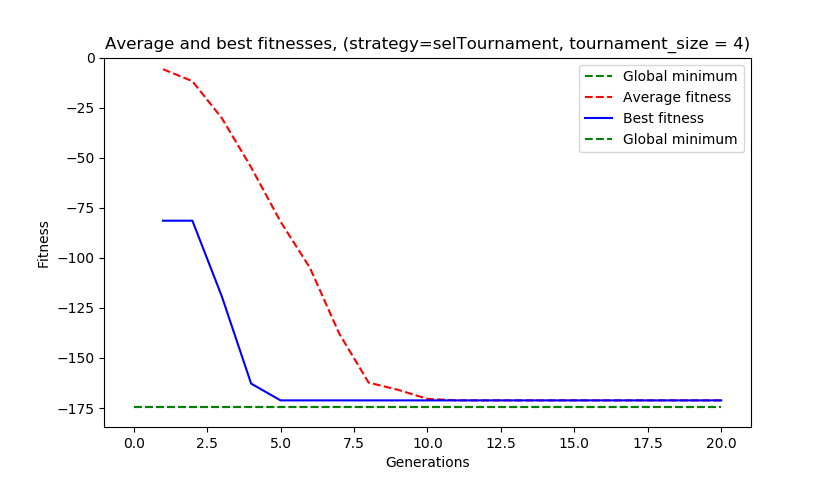

This experiment aims to test different selection strategies.
Selection was tested on the 5-dimensional Alpine-2 test function.


The global minimum is located at x∗= (7.917, ... , 7.917), f(x*) = 2.808^n.
Throughout the experiment, the following options are kept fixed:
```python
DIMENSIONS = 5
population size = 200
generations = 20
CXPB, MUTPB = 0.6, 0.3
toolbox.register('attr_float', random.uniform, 0, 10)
toolbox.register('evaluate', alpine2)
toolbox.register('mate', tools.cxTwoPoint)
toolbox.register('mutate', tools.mutGaussian, mu=0, sigma=0, indpb=0.2)
```

The following variables were changed in the experiment:
```python
# Selection methods and corresponding input parameters
toolbox.register('select', tools.selTournament, tournsize=)
# run_evolution() function structure
def run_evolution(seed)
```

##1. Selection strategies

###1.1. Tournament selection: selTournament()

Selection strategy: select the best individual among a randomly chosen set of individuals.

Parameters:
* varied: tournsize – The number of individuals participating in each tournament.
* constant: individuals – A list of individuals to select from.
* constant: k – The number of individuals to select.
* constant: fit_attr – The attribute of individuals to use as selection criterion

####1.1.1. tournament size = 1

* Experiments with a score better than -120: 0/100
* Experiments with a score better than -150: 0/100
* Experiments with a score better than -170: 0/100

Best experimental result
Best individual:  [7.98562313 8.62751229 8.27303936 8.29484416 8.11961802]
Best fitness: -110.77666405599369


####1.1.2. tournament size = 2

* Experiments with a score better than -120: 56/100
* Experiments with a score better than -150: 23/100
* Experiments with a score better than -170: 0/100

Best experimental result

Best individual:  [7.69176923 7.75472628 7.90173225 7.91894785 7.85346858]

Best fitness: -167.58213900024774


####1.1.3. tournament size = 3

* Experiments with a score better than -120: 56/100
* Experiments with a score better than -150: 33/100
* Experiments with a score better than -170: 1/100

Best experimental result

Best individual:  [7.76130447 7.9801863  7.97032764 7.92294022 7.78285901]

Best fitness: -170.3375103892205


####1.1.4. tournament size = 4

* Experiments with a score better than -120: 58/100
* Experiments with a score better than -150: 31/100
* Experiments with a score better than -170: 2/100

Best experimental result

Best individual:  [8.07420322 7.97408283 7.98042713 7.94018064 7.83674863]

Best fitness: -171.18599315421577



####1.1.5. tournament size = 8

* Experiments with a score better than -120: 45/100
* Experiments with a score better than -150: 15/100
* Experiments with a score better than -170: 2/100

Best experimental result

Best individual:  [7.76849731 7.96949102 8.01975725 7.8425946  7.90943552]

Best fitness: -171.03430102782767


####1.1.6. tournament size = 16

* Experiments with a score better than -120: 29/100
* Experiments with a score better than -150: 10/100
* Experiments with a score better than -170: 0/100

Best experimental result

Best individual:  [7.76130447 7.94570677 8.08345882 7.92294022 7.78285901]

Best fitness: -168.45279671010204


Comments: This subexperiment was ran multiple times,
but for some reason it in all +- 5 runs looked liked this.
Why? Dont know. Looks like with tournament size of 16
the first step arrives at a good solution and gets stuck.


####1.1.7. tournament size = 32

* Experiments with a score better than -120: 23/100
* Experiments with a score better than -150: 4/100
* Experiments with a score better than -170: 0/100

Best experimental result

Best individual:  [7.71048394 7.8763845  8.06778669 7.61539264 7.70756156]

Best fitness: -157.62863940638675


Comments: Again the algorithm arrives quickly to a local
optimum and gets stuck at a suboptimal solution. Even
less suboptimal than with tournament size of 16.

####1.1.8. tournament size = 64

* Experiments with a score better than -120: 30/100
* Experiments with a score better than -150: 12/100
* Experiments with a score better than -170: 0/100

Best experimental result

Best individual:  [7.87208675 8.01977402 8.01972542 8.04072596 7.75126414]

Best fitness: -168.87570193665988


Comments: This time the solution converges a bit more
slowly in generation than when tournament size was 32. Could feel that 
running this experiment took more time, than smaller tournament sizes,
but need to do computation cost tests to get real results.

####1.1.9. tournament size = 128

* Experiments with a score better than -120: 25/100
* Experiments with a score better than -150: 13/100
* Experiments with a score better than -170: 2/100

Best experimental result

Best individual:  [8.07420322 7.97408283 7.98042713 7.94018064 7.83674863]

Best fitness: -171.18599315421577


Comments: Could feel that running this experiment took more time,
than smaller tournament sizes, but need to do computation cost tests
to get real results.

####1.1.10. tournament size = 200

* Experiments with a score better than -120: 18/100
* Experiments with a score better than -150: 6/100
* Experiments with a score better than -170: 0/100

Best experimental result

Best individual:  [7.79278942 7.89741098 7.80782221 8.13676002 7.71010352]

Best fitness: -164.3661649324561


Comments: This is the extreme case where population size =
tournament size.

###Conclusions

* Strategy = selTournament(), where tournament size = 
[1, 2, 3, 4, 8, 16, 32, 64, 128, 200]

Tournament size of 1 does poorly as expected (selecting a
random candidate). Tournament size of 2 works. Increasing tournament
size from 2 to 4 improves performance and convergence rate in generations.

Increasing tournament size to 16, 32, and up doesn't improve performance
in general and sometimes even decreases it by converging to a bad solution.
That said convergence speed in generations tends to increase with
tournament size increasing up to a limit.

Given the constant parameters tournament selection strategy 
works alright for tournament size of 4 and 8 in this case.

###1.2. Tournament selection: selRoulette()

Description: "Select k individuals from the input individuals using k spins of a roulette. The selection is made by looking only at the first objective of each individual. The list returned contains references to the input individuals."

Bad performance, often doesn't improve at all over 20 generations.

###1.3. Tournament selection: selNSGA2()

Description: "Apply NSGA-II selection operator on the individuals. Usually, the size of individuals will be larger than k because any individual present in individuals will appear in the returned list at most once. Having the size of individuals equals to k will have no effect other than sorting the population according to their front rank. The list returned contains references to the input individuals. For more details on the NSGA-II operator see [Deb2002]."

* Experiments with a score better than -120: 20/100
* Experiments with a score better than -150: 6/100
* Experiments with a score better than -170: 0/100

Best experimental result

Best individual:  [8.03025385 8.14095709 8.05845288 7.94428087 7.64661905]

Best fitness: -161.19561899610366


Comments: Poor performance over most of the runs.
Best case run is also not that good.

###1.4. Tournament selection: selRandom()

Description: "Select k individuals at random from the input individuals with replacement. The list returned contains references to the input individuals."

* Experiments with a score better than -120: 0/100
* Experiments with a score better than -150: 0/100
* Experiments with a score better than -170: 0/100

Best experimental result

Best individual:  [7.98562313 8.62751229 8.27303936 8.29484416 8.11961802]

Best fitness: -110.77666405599369


Comments: poor performance as expected.


###1.5. Tournament selection: selBest()

Description: "Select the k best individuals among the input individuals. The list returned contains references to the input individuals."

* Experiments with a score better than -120: 20/100
* Experiments with a score better than -150: 6/100
* Experiments with a score better than -170: 0/100

Best experimental result

Best individual:  [8.03025385 8.14095709 8.05845288 7.94428087 7.64661905]

Best fitness: -161.19561899610366


Comments: Finds a suboptimal okay solution within 20 generations,
find a lot better solution in a 100 generations. Average fitnes
doesn't converge, probably the population stays dense and this
method and its parameters are similar to a random search.

###1.6. Tournament selection: selWorst()

Description: "Select the k worst individuals among the input individuals. The list returned contains references to the input individuals."

* Experiments with a score better than -120: 58/100
* Experiments with a score better than -150: 14/100
* Experiments with a score better than -170: 0/100

Best experimental result

Best individual:  [7.86084021 7.85921165 7.83343732 8.14208349 7.83531267]

Best fitness: -168.39678789639004


Comments: Average fitness doesn't converge to best fitness in 
200 generations. Does manage to find a pretty good result at best
case over 200 generations. This is probably similar to random
search, where the strategy in this case defines a type of a
randomness.


###1.7. Tournament selection: selLexicase 

Description: "Returns an individual that does the best on the fitness cases when considered one at a time in random order. http://faculty.hampshire.edu/lspector/pubs/lexicase-IEEE-TEC.pdf"

* Experiments with a score better than -120: 1/100
* Experiments with a score better than -150: 0/100
* Experiments with a score better than -170: 0/100

Best experimental result

Best individual:  [7.9188419  7.71387212 8.44658356 7.77070247 8.05349052]

Best fitness: -143.8603768111893


Comments: poor performance and slow.

## Conclusion

* Tournament selection works best, but converges perhaps too quickly. 
* Tournament selection conclusions:
    * Strategy = selTournament(), where tournament size = 
      [1, 2, 3, 4, 8, 16, 32, 64, 128, 200]

    * Tournament size of 1 does poorly as expected (selecting a
      random candidate). Tournament size of 2 works. Increasing tournament
      size from 2 to 4 improves performance and convergence rate in generations.

    * Increasing tournament size to 16, 32, and up doesn't improve performance
       in general and sometimes even decreases it by converging to a bad solution.
       That said convergence speed in generations tends to increase with
       tournament size increasing up to a limit.

    * Given the constant parameters tournament selection strategy 
      works alright for tournament size of 4 and 8 in this case.
    
* It is non trivial to converge to a good solution and have a lot of
  diversification. Diversification tends to decrease with finding a 
  good solution in a manner that isn't completely random. If there
  is the global optimum is far from all the best local optima then this
  makes sense, however if the global optima isn't much better than some
  of the local optima then it would be desirable to keep a more diverse
  population. Selection goal I'd say is to converge to an optimum 
  while keeping diversification high for long enough so that the final
  optima is close to the global one. Selection via tournament does this
  pretty well, but could benefit from a mechanism to retain more diversity.
  (Maybe this could be done via multi objective optimization, where in
  addition to fitness also similarity is measured.) 